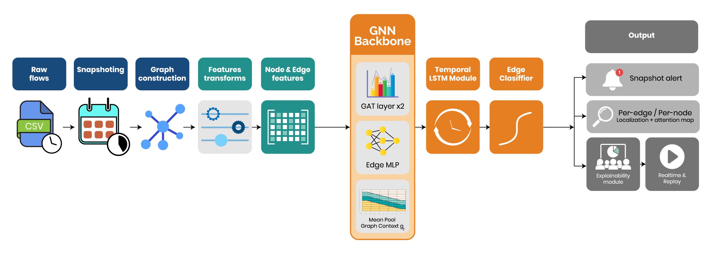
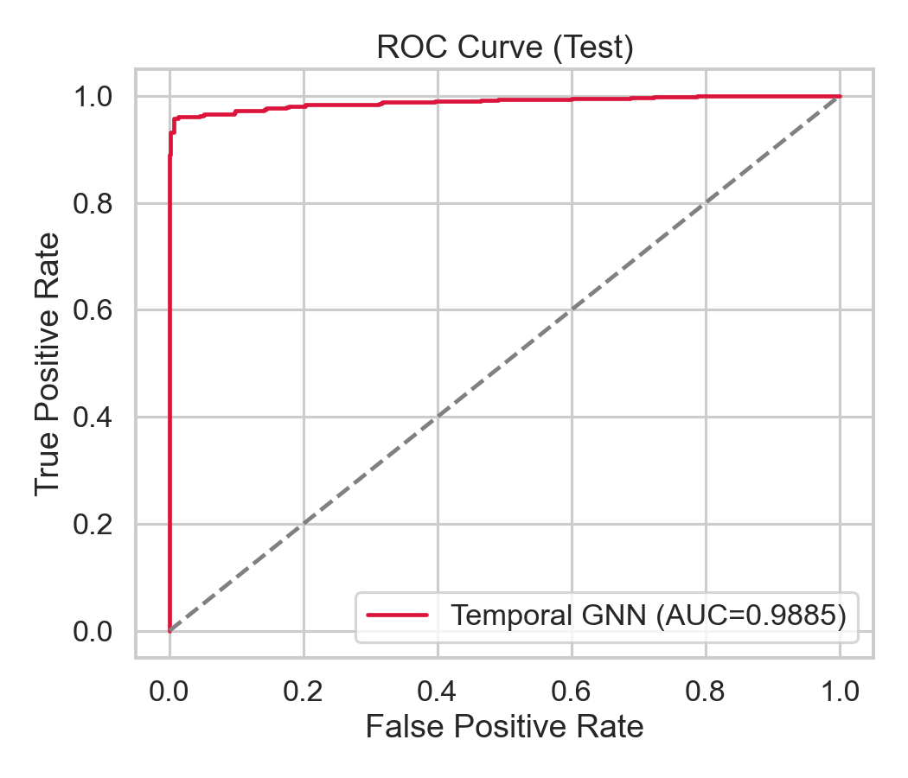
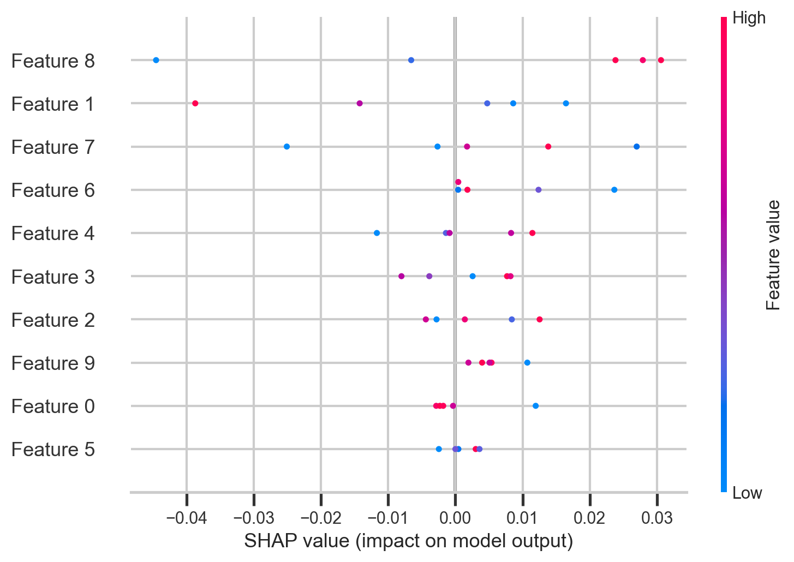
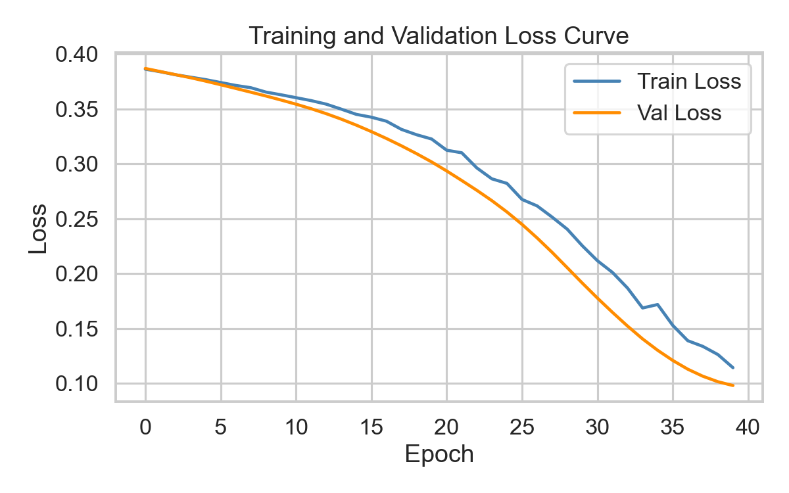
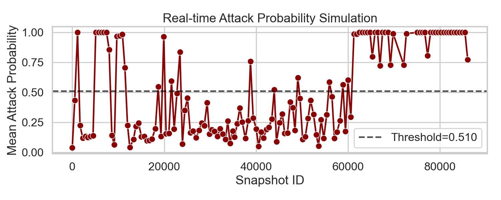

# Temporal Explainable GNN for Real-Time Intrusion Detection


This project builds an intrusion detection system that treats network traffic as a sequence of dynamic graphs instead of isolated tabular rows. The goal is not only to classify malicious traffic, but also to make the decisions easier to inspect and easier to carry into a near-real-time monitoring workflow.

The repository combines four things in one place:

- a reproducible training and evaluation pipeline,
- a temporal graph neural network for attack detection,
- explainability utilities and saved XAI artifacts,
- and a realtime detector with a desktop GUI for running the system end to end.

## Project Snapshot

This repository presents a temporal, explainable intrusion detection workflow over dynamic network graphs built from CICIDS-style traffic data. Instead of only reporting an offline machine-learning score, the project connects dataset preprocessing, graph construction, temporal GNN training, explanation generation, realtime-style inference, and paper writing in one unified codebase.

It is designed for two audiences at the same time:

- researchers who want a clearer and more reproducible graph-based IDS workflow,
- and practitioners or students who want to see how a trained cyberattack detector can be moved toward live monitoring.

## Workflow Overview



The end-to-end workflow is:

1. ingest CICIDS-style CSV network-flow data
2. clean and standardize the schema
3. group flows into temporal windows
4. build snapshot graphs from communicating endpoints
5. train a temporal GNN for edge-level attack detection
6. compare against baselines and choose an operating threshold
7. generate explainability artifacts
8. export deployment metadata for realtime inference
9. run the detector on an appending CSV stream or through the GUI

## Results At A Glance

The repository already includes saved evaluation artifacts from the upgraded temporal model.

### Checked-in operating points

| Operating mode | Threshold | Accuracy | Precision | Recall | F1 | FAR |
|---|---:|---:|---:|---:|---:|---:|
| Selected deployment-friendly point | 0.47 | 0.9387 | 0.8418 | 0.8459 | 0.8438 | 0.0387 |
| Conservative low-FAR point | 0.66 | 0.9391 | 0.8992 | 0.7754 | 0.8327 | 0.0211 |

### Model comparison from saved artifact

| Model | Accuracy | Precision | Recall | F1 | FAR |
|---|---:|---:|---:|---:|---:|
| TemporalGNN_Upgraded_Rank1 | 0.9391 | 0.8992 | 0.7754 | 0.8327 | 0.0211 |
| StackedMetaLR | 0.9387 | 0.8975 | 0.7754 | 0.8320 | 0.0215 |

These numbers are taken from the checked-in evaluation files:

- `evaluation/model_comparison.csv`
- `evaluation/temporal_gnn_upgraded_rank1_metrics.json`
- `evaluation/temporal_gnn_upgraded_rank1_calibrated_metrics.json`

### Example repository artifacts

| ROC / PR Curves | Explainability Samples |
|---|---|
|  |  |

| Training Diagnostics | Realtime Simulation |
|---|---|
|  |  |

## What This Project Is Aimed For

Traditional intrusion detection models often look at one flow at a time. That works for some attacks, but it can miss the interaction structure of a network and the way traffic changes over time.

This project is aimed at solving that by:

- converting network flows into time-based graph snapshots,
- learning node-edge communication patterns with a temporal GNN,
- reducing overly optimistic evaluation through train-only preprocessing,
- supporting analyst-facing explanations,
- and moving the trained model toward a realtime detection setting.

In simple terms, the project tries to answer this question:

How can we detect cyberattacks from evolving network traffic while also keeping the model explainable and usable in a practical monitoring pipeline?

## What We Have Done Here

The repository already includes a fairly complete research-to-deployment workflow:

1. Data ingestion from CICIDS-style CSV files in `data/`
2. Flow preprocessing and schema alignment
3. Snapshot creation with fixed temporal windows
4. Graph construction from source and destination endpoints
5. Temporal GNN training and evaluation
6. Baseline comparison against classical ML models
7. Explainability analysis with graph-native and post hoc methods
8. Realtime CSV-tail detection using exported deployment artifacts
9. A single-file GUI to run training and realtime monitoring from one app
10. An IEEE conference paper in LaTeX under `paper/`

## Core Idea

Each network flow becomes an edge in a graph. Endpoints such as source and destination IPs become nodes. Instead of predicting from one row alone, the model can observe:

- which endpoints communicate repeatedly,
- how traffic clusters around busy nodes,
- how communication changes across time windows,
- and which structural patterns appear during attack activity.

The temporal model then uses graph attention and sequence modeling to classify attack-related behavior across snapshots.

## Main Features

### 1. Reproducible training pipeline

The training entry point is `training/run_training.py`.

It provides:

- configurable training through `config.yml`,
- explicit train/validation/test split modes,
- train-only transform fitting to reduce leakage,
- baseline comparisons,
- ablation-style evaluation support,
- threshold selection for different operating modes,
- and export of deployment-ready artifacts.

### 2. Temporal graph intrusion detection

The project uses a temporal graph neural network pipeline built around graph attention and temporal context modeling.

The repository currently contains:

- the reproducible CLI pipeline model used by `training/run_training.py`,
- and a more experimental upgraded notebook model explored in `notebooks/main_pipeline.ipynb`.

The notebook version extends the research side of the project and is where richer experimentation, calibration, and extra XAI logic have been explored.

### 3. Explainable AI support

Explainability is a central part of this repository, not an afterthought.

The project includes:

- permutation feature importance,
- GAT attention explanations,
- gradient-style attribution plots,
- SHAP helper support,
- LIME helper support,
- and saved explanation figures under `evaluation/plots/explain/`.

The helper module `explainability/xia.py` exposes lightweight wrappers for SHAP and LIME so the model can be inspected through a NumPy-friendly interface.

### 4. Realtime detection workflow

The file `training/realtime_detect.py` loads the exported deployment manifest and tails an appending CSV stream. It applies the saved preprocessing parameters, rebuilds temporal snapshots, runs inference, and emits attack alerts.

This means the repository is not limited to offline experiments. It also demonstrates how a trained model can be moved into a streaming-style detection setup.

### 5. Unified desktop GUI

The file `temporal_gnn_gui_app.py` brings the workflow together in one place.

The GUI lets you:

- edit configuration values,
- start or stop training,
- start or stop realtime detection,
- select deployment files and input streams,
- and monitor logs live from the interface.

## Repository Structure

```text
project_root/
|-- config.yml
|-- data/
|-- evaluation/
|-- explainability/
|-- graph_builder/
|-- models/
|-- notebooks/
|-- paper/
|-- preprocessing/
|-- snapshots/
|-- tools/
|-- training/
|   |-- pipeline_core.py
|   |-- realtime_detect.py
|   |-- run_training.py
|-- temporal_gnn_gui_app.py
|-- requirements.txt
|-- README.md
```

## Important Folders

- `data/`  
  Contains CICIDS-style CSV files used for training and evaluation.

- `training/`  
  Contains the main training pipeline, shared core logic, and realtime detector.

- `models/`  
  Stores trained model checkpoints such as the temporal GNN weights.

- `evaluation/`  
  Stores generated metrics, reports, simulation outputs, plots, and explainability artifacts.

- `explainability/`  
  Contains SHAP and LIME helper utilities in `xia.py`.

- `notebooks/`  
  Contains the research notebook where upgraded model experiments and extra XAI steps were developed.

- `paper/`  
  Contains the IEEE conference paper source in LaTeX format.

## Environment Setup

Create and activate a Python virtual environment, then install dependencies:

```powershell
py -3.11 -m venv venv
.\venv\Scripts\Activate.ps1
python -m pip install --upgrade pip
pip install -r requirements.txt
```

If you also want the SHAP/LIME-specific extras separated in this repository, check:

```powershell
pip install -r requirements-xia.txt
```

## How To Run Training

Run the full reproducible training pipeline from the repository root:

```powershell
python -m training.run_training --config config.yml
```

For a quicker smoke test:

```powershell
python -m training.run_training --config config.yml --fast-smoke
```

This pipeline is designed to:

- read and preprocess the dataset,
- create snapshot-level graph data,
- split snapshots using the selected policy,
- train the temporal GNN,
- compare it with baseline models,
- choose an operating threshold,
- and save outputs for later analysis and deployment.

## How To Run Realtime Detection

After training, the pipeline generates `evaluation/deployment_artifacts.json`. That file is used by the realtime detector.

Basic run:

```powershell
python -m training.realtime_detect --deployment evaluation/deployment_artifacts.json --input-csv data/live_flows.csv
```

Example with extra control flags:

```powershell
python -m training.realtime_detect --deployment evaluation/deployment_artifacts.json --input-csv data/live_flows.csv --poll-seconds 1 --max-rows-per-read 2000 --output-csv evaluation/realtime_alerts.csv
```

The realtime detector:

- tails a growing CSV file,
- aligns the incoming schema,
- restores saved preprocessing transforms,
- builds temporal windows,
- runs the trained model,
- and writes alert information for each processed snapshot.

## How To Run The GUI

Launch the unified app with:

```powershell
python temporal_gnn_gui_app.py
```

This is useful if you want to run the project without remembering every command-line flag manually.

## Key Output Artifacts

After running training and evaluation, the repository can contain outputs such as:

- `evaluation/model_comparison.csv`
- `evaluation/ablation_results.csv`
- `evaluation/seed_metrics.csv`
- `evaluation/significance_report.csv`
- `evaluation/run_manifest.json`
- `evaluation/deployment_artifacts.json`
- `evaluation/temporal_gnn_metrics.json`
- `evaluation/temporal_gnn_upgraded_rank1_metrics.json`
- `evaluation/temporal_gnn_upgraded_rank1_calibrated_metrics.json`
- `evaluation/permutation_feature_importance.csv`
- `evaluation/realtime_simulation_results.csv`

Plots and visual artifacts are stored in:

- `evaluation/plots/`
- `evaluation/plots/explain/`

Model weights are stored in:

- `models/`

## What We Get From This Project

This project gives us more than just a trained classifier.

It provides:

- a temporal graph-based intrusion detection workflow,
- a cleaner experimental pipeline for academic reporting,
- saved checkpoints and deployment metadata,
- explainable outputs for model inspection,
- a realtime-style detector for streaming flow files,
- a GUI for easier operation,
- and a paper-ready research artifact under `paper/`.

From a research perspective, the project shows how graph structure, temporal context, and XAI can be combined for cybersecurity.

From a practical perspective, it gives a starting point for moving a trained IDS model toward analyst-facing use.

## Current Evaluation Snapshot

The checked-in repository already includes evaluation artifacts and plots from prior runs. Those artifacts are the basis for the current paper and project discussion.

Examples of what is already available in the repo:

- model comparison tables,
- ROC and precision-recall curves,
- confusion matrix and loss curves,
- permutation importance plots,
- attention and gradient explainability snapshots,
- SHAP and LIME visualizations,
- and realtime simulation outputs.

Because these artifacts are versioned in the repository, someone reading the project can understand both the modeling pipeline and the current evidence produced by it.

## Notes On Split Policy And Realism

For strict deployment-style evaluation, prefer:

- `split_mode: per_day_temporal`
- or `split_mode: chronological`

The repository also supports:

- `split_mode: stratified_snapshot`

That option can be useful for analysis, but it is less strict than a temporally ordered deployment-style split.

## Paper And Publication Material

The IEEE conference paper source is located in:

- `paper/ieee_conference_paper.tex`

Supporting files include:

- `paper/references.bib`
- `paper/README.md`

This makes the repository useful not only as a coding project, but also as a research submission package.

## Suggested Workflow For New Users

If you are opening this project for the first time, a good order is:

1. Read this `README.md`
2. Review `config.yml`
3. Run `python -m training.run_training --config config.yml`
4. Inspect outputs in `evaluation/`
5. Try `python -m training.realtime_detect ...`
6. Open `temporal_gnn_gui_app.py` if you prefer a GUI workflow
7. Review `notebooks/main_pipeline.ipynb` for the richer research and XAI context
8. Open `paper/ieee_conference_paper.tex` for the paper version of the project

## Summary

This repository is a complete temporal explainable intrusion-detection project built around dynamic network graphs. It covers data preparation, graph construction, temporal GNN training, explainability, realtime detection, GUI-based operation, and IEEE-style paper writing in one place.

In short, we have built a project that is both:

- research-oriented enough for paper preparation,
- and practical enough to demonstrate a path toward realtime cyberattack detection with explainable outputs.
